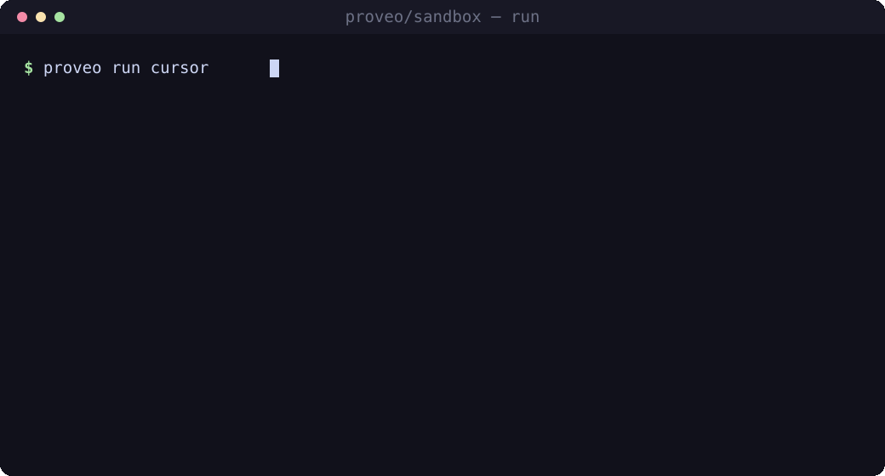
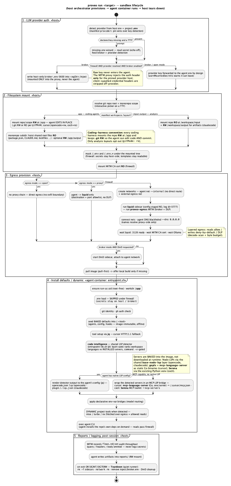
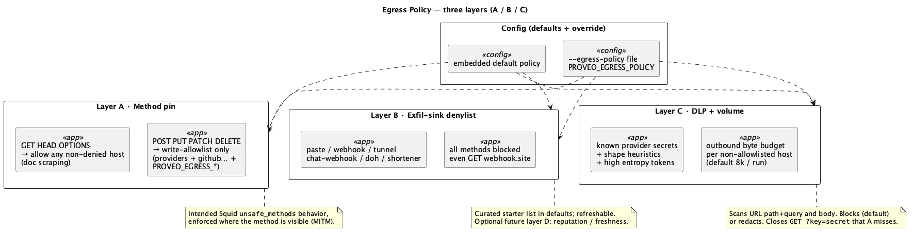

# proveo/sandbox

> Portable, hardened Docker sandboxes for AI coding agents — one command, any repo.



<sub>The capability picker on `e2e/samples`. Record a live terminal version with `vhs _spec/_assets/hero.tape`.</sub>

`proveo run <agent>` drops a coding agent (opencode, Claude Code, Cursor, cecli) into an
**ephemeral, hardened container** scoped to your repo — with enforced egress, a credential
broker that keeps API keys **out of the agent**, opt-in Playwright/browser and Docker-in-Docker,
and local-model support where the harness allows it. No per-tool setup.

## Install

```sh
curl -fsSL https://proveo.ca/cli/install.sh | bash      # Linux · macOS · FreeBSD
```
```powershell
irm https://proveo.ca/cli/install.ps1 | iex             # Windows
```

Checksum-verified static binaries (amd64 + arm64). After install: `proveo version`,
`proveo update --check`, `proveo uninstall`.

### Publish a CLI release

```bash
git tag -a v0.1.0 -m "…"
git push origin v0.1.0          # optional but good
mise run deploy-cli
```

On an exact tag this builds multi-arch binaries (goreleaser, no GitHub Release), stages
`latest.json` + checksums into `apps/cli/public/cli`, and deploys to Cloudflare via Wrangler.
Details: [`apps/cli/README.md`](apps/cli/README.md).

## Quickstart — try it on the sample

The repo ships a **polyglot monorepo sample** (Go API · Rust harness · Bun/TS TUI · TS workspace
package) at [`e2e/samples/`](e2e/samples) — the same workspace the E2E suite drives.

```bash
cd e2e/samples

proveo run opencode                          # capability picker (Tab: browser / DinD), then boots
proveo run cursor                            # broker egress (Cursor inference is vendor-pinned)
proveo run opencode --local-model gemma4     # fully local via an Ollama sidecar — no cloud key
```

`proveo run` opens a **capability picker** — *press tab to add an option (browser, DinD, agent
evidence), or enter to continue* — then launches the agent against your repo with the guarantees
below. Agents run at their most verbose by default: thoughts, tool calls and diffs on screen
([`CODING_HARNESSES.md`](CODING_HARNESSES.md#agent-evidence)).

## Supported languages & tooling

Detected in your workspace and provisioned on demand — nothing is baked into every image.

       

Detection is monorepo-aware: it walks the invocation scope to depth 7, pruning dependency
and build trees (`node_modules`, `vendor`, `target`, `dist`, …) so a dependency's
`Dockerfile` is never mistaken for the workspace's own. The registry lives in
`cmd/proveo/main.go` (`toolingMarkers`) and is the single source of truth for both these
pills and the first-run choice prompt.

## Agents & variants

| Agent | Images | Notes |
| --- | --- | --- |
| **opencode** | `opencode` · `opencode-browser` | subagent crew; native LSP; `--local-model` |
| **Claude Code** | `claudecode` (+ `-solidity`, `-browser`) | MCP / Solidity toolchain; subscription auth (Anthropic) |
| **Cursor** | `cursor` · `cursor-browser` | vendor-pinned inference → broker egress; subscription auth |
| **cecli** | `cecli` | aider fork (Python); `--local-model` |

`-browser` variants add **Playwright + Chromium** (opt-in via the picker, sharing one Chromium
layer).

**Local models** (`--local-model` / Ollama sidecar): **opencode** and **cecli** only. Cursor is
vendor-pinned (rejected). Claude Code speaks the Anthropic API shape, not Ollama’s OpenAI-compatible
endpoint — the sidecar is not a drop-in ([`_spec/tests/testing-strategy.puml`](_spec/tests/testing-strategy.puml)).

**Subscription agents** (claudecode, cursor): proveo warns if auth env is missing and
lets the agent handle login; after the sandbox exits it prints shell-specific setup hints
(`.env` or a safe host location). Prefer host env / project `.env` over in-sandbox login tokens.

## How it works

Every run is a host-orchestrated, ephemeral sandbox: detect provider auth → mount the repo →
provision egress → boot the agent → record + tear down.



## Security — egress & credentials

Two independent axes. `--egress-mode` picks the **network tier**, and the tiers are cumulative:

| tier | network |
| --- | --- |
| `open` | no allowlist — the agent may reach any host |
| `allowlist` (default) | Squid allowlist + method pin + DLP scan |
| `review` | the allowlist, plus an interactive prompt per new connection |

`--credentials` picks how the agent authenticates. The default `broker` keeps your API key
**host-side** and injects it at the MITM, so it never enters the agent (the container only ever
sees a sentinel). `forward` hands the real value to the container, which is required for the two
cases injection cannot serve: a vendor that pins its TLS (cursor), and DinD.

Every tier brokers credentials except `--egress-mode open --credentials forward`, which is the
deliberate bypass. Even `open` keeps the exfil-sink denylist and the DLP secret scan — an open
network must not become an open channel for the key itself.

The older `--egress-mode broker|proxy|firewall` names still work and map to
`open|review|allowlist`, with a warning: they used to imply credential handling, which now lives
on `--credentials`.



| Mode | Credentials | Egress |
| --- | --- | --- |
| **firewall** | brokered — real key only on the proxy sidecar | allowlist + DLP scan |
| **broker** | forwarded into the container (dev) | direct bridge |
| **proxy** | in-process | Squid allowlist (no TLS inspection) |

Keep `.env` on the **host** — do not bind-mount it into the agent.

## Proveo home (session resume)

Agent sessions and seeded home config persist under `~/.proveo/` (override with
`PROVEO_HOME`), bind-mounted at `/proveo-home` with `HOME` pointed there. Host IDE homes
are never mounted; login token files listed in each harness `home.mounts.deny` are
scrubbed before every run.

| Harness | Host path | Resume |
| --- | --- | --- |
| cursor | `~/.proveo/.cursor` | `proveo run cursor --resume <id>` / `--continue` / `--ls` |
| claudecode | `~/.proveo/.claude` | `proveo run claudecode --resume <id>` / `--continue` |
| opencode | `~/.proveo/opencode/{config,share}` | `proveo run opencode --resume <session-id>` |
| cecli | `~/.proveo/.cecli` | home conf only (project state stays in `/app/.cecli`) |

Routine `proveo clean` leaves this cache alone; reclaim with `proveo clean --homes`.

## Specs

Architecture, the full egress policy, testing strategy, and the
[Docker-Sandbox experiment](_spec/_experiments/docker-sandbox.puml) live in [`_spec/`](_spec)
as PlantUML diagrams + notes. Conventions: [`CONVENTIONS.md`](CONVENTIONS.md).
